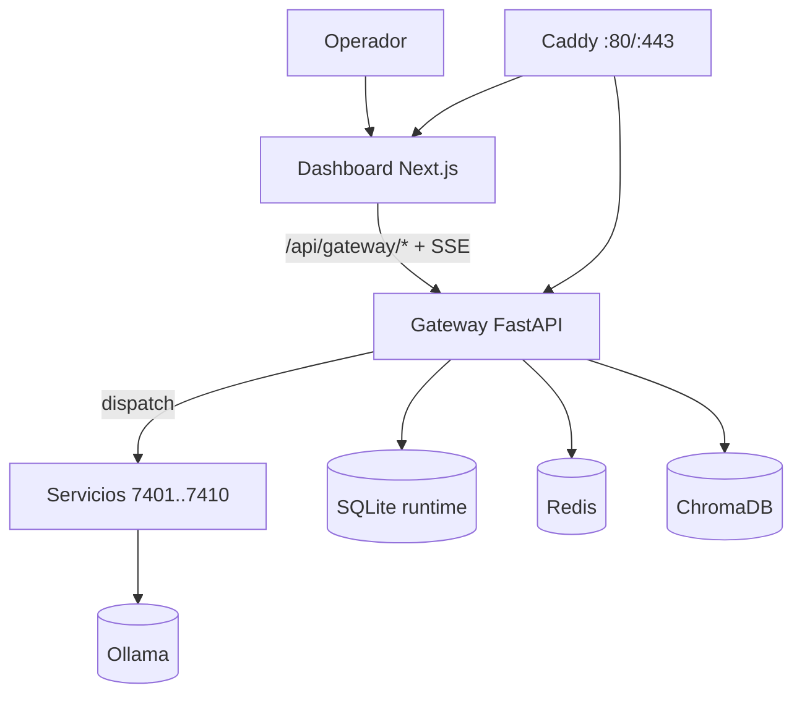
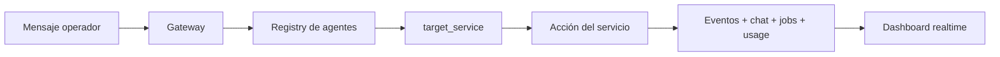

<h1 align="center">⚗️ Alchemical Agent Ecosystem</h1>

<p align="center">
  
</p>

<p align="center"><em>Cockpit multiagente local-first para orquestación real, control en tiempo real y operación segura.</em></p>

<p align="center">
  
</p>

<p align="center">
  <a href="./LICENSE"></a>
  <a href="https://github.com/smouj/alchemical-agent-ecosystem/commits/main"></a>
  <a href="https://github.com/smouj/alchemical-agent-ecosystem/actions/workflows/ci.yml"></a>
  <a href="https://github.com/smouj/alchemical-agent-ecosystem/actions/workflows/release.yml"></a>
  <a href="https://github.com/smouj/alchemical-agent-ecosystem/actions/workflows/sync-project-status.yml"></a>
  
  
  
  
  
  
</p>

<p align="center">
  <a href="./README.md"></a>
  <a href="./README.es.md"></a>
</p>

---

## 🚀 Instalación primero (recomendado)

```bash
cd /mnt/d/alchemical-agent-ecosystem
./install.sh --wizard
./scripts/alchemical up-fast
curl -fsS http://localhost/gateway/health
```

URLs runtime:
- `http://localhost` → runtime vía Docker + Caddy
- `http://localhost:3000` → dashboard en modo dev (`cd apps/alchemical-dashboard && npm run dev`)

---

## ✨ Para qué sirve este proyecto

Usa Alchemical cuando necesitas un **cockpit operativo local** para flujos multiagente:
- orquestar agentes lógicos sobre servicios reales,
- gestionar conectores/jobs/eventos/chat desde una sola UI,
- ejecutar discusiones multiagente y dispatch de acciones,
- mantener runtime observable, auditable y seguro.

---

## 🧠 Capacidades clave (implementadas)

| Área | Capacidad actual |
|---|---|
| Control de agentes | Start/stop/restart + chequeo dispatch |
| Personalización de agentes | **Agent Node Studio** (nodos + etiquetas skills/tools) |
| Chat | Hilo compartido + ask directo + roundtable |
| Realtime | Streams SSE de chat/eventos/usage/logs |
| Seguridad operativa | Token auth + RBAC + API keys + secret scan |
| Datos runtime | Jobs, eventos, usage y chat persistidos |

---

## 🏗️ Arquitectura (realidad actual)





---

## 🧩 API destacada

- `POST /gateway/chat/ask`
- `POST /gateway/chat/roundtable`
- `GET /gateway/chat/stream`
- `GET /gateway/usage/summary`
- `POST /gateway/connectors/webhook/{channel}`

Referencia completa: [`docs/API_REFERENCE.md`](./docs/API_REFERENCE.md)

---

## 📚 Documentación

- [`docs/README.md`](./docs/README.md)
- [`docs/INSTALLATION.md`](./docs/INSTALLATION.md)
- [`docs/CLI_REFERENCE.md`](./docs/CLI_REFERENCE.md)
- [`docs/ARCHITECTURE.md`](./docs/ARCHITECTURE.md)
- [`docs/OPERATIONS_RUNBOOK.md`](./docs/OPERATIONS_RUNBOOK.md)

---

## 🔄 Ritual del proyecto

```bash
bash ops/ritual-sync.sh
```

---

## 📄 Licencia

MIT
