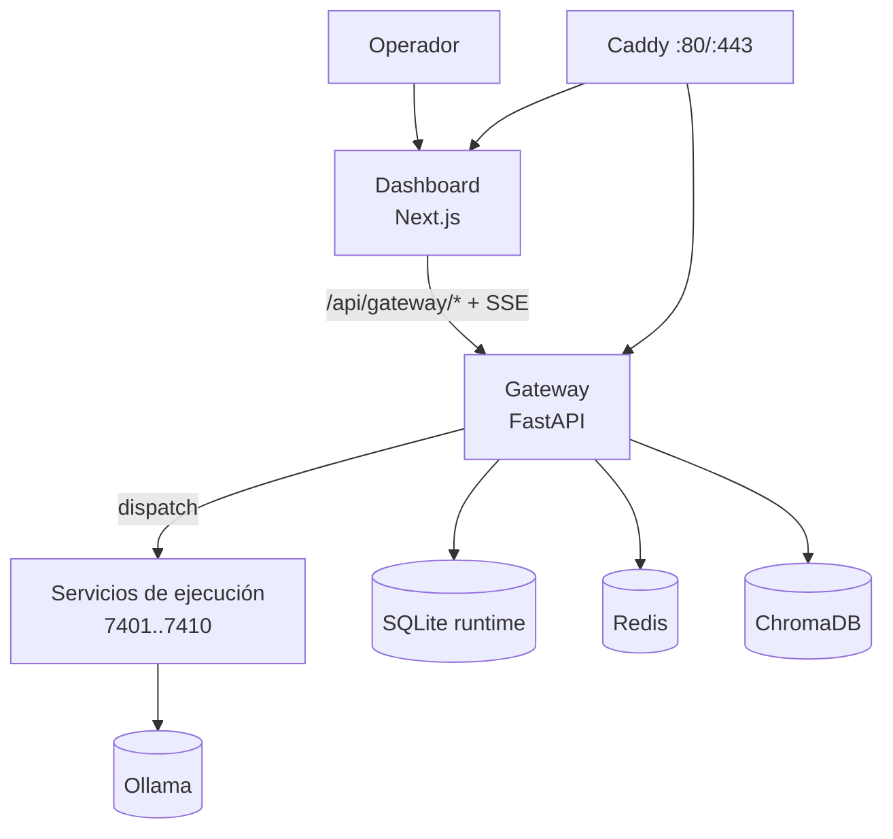
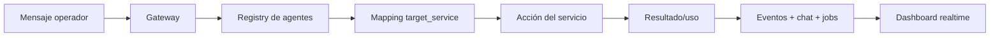

<h1 align="center">⚗️ Alchemical Agent Ecosystem</h1>

<p align="center">
  
</p>

<p align="center"><em>Control plane multiagente local-first · orquestación runtime real · operación orientada a producción</em></p>

<p align="center">
  <a href="./LICENSE"></a>
  <a href="https://github.com/smouj/alchemical-agent-ecosystem/commits/main"></a>
  <a href="https://github.com/smouj/alchemical-agent-ecosystem/actions/workflows/ci.yml"></a>
  <a href="https://github.com/smouj/alchemical-agent-ecosystem/actions/workflows/release.yml"></a>
  <a href="https://github.com/smouj/alchemical-agent-ecosystem/actions/workflows/sync-project-status.yml"></a>
  
  
  
  
  
</p>

<p align="center">
  <a href="./README.md"></a>
  <a href="./README.es.md"></a>
</p>

---

## Resumen

Alchemical Agent Ecosystem es una plataforma local-first donde:
- el Dashboard es el cockpit del operador,
- el Gateway es el límite de política/routing/runtime,
- los servicios de ejecución realizan acciones reales,
- eventos/jobs/chat/usage quedan persistidos y observables.

No se usan mocks para los flujos core.

---

## Arquitectura (realidad actual)

<p align="center"><strong>Arquitectura runtime</strong></p>

<div align="center">



</div>

<p align="center"><strong>Modelo lógico de agentes</strong></p>

<div align="center">



</div>

---

## Capacidades del dashboard (implementadas)

- Estado en vivo de servicios y agentes lógicos
- Control de agentes (start/stop/restart + ping dispatch)
- Agent Node Studio: grafo interactivo para mapear agentes y vincular skills/tools visualmente
- Chat del gateway con:
  - mensajes al hilo,
  - envío directo al agente,
  - roundtable multi-agente,
  - metadatos repo/thinking/auto-edit,
  - adjuntos en modo metadata
- Paneles realtime de jobs y eventos
- Panel realtime de uso/coste
- Admin/API keys + operaciones de conectores
- Navegación funcional por secciones en sidebar
- Tema visual carbono/ceniza con acentos turquesa/púrpura/celeste/verde

---

## Comandos esenciales

```bash
# 1) instalar
./install.sh --wizard

# 2) iniciar runtime
./scripts/alchemical up-fast

# 3) health check
curl -fsS http://localhost/gateway/health

# 4) dashboard en modo dev
cd apps/alchemical-dashboard && npm run dev
```

Modos de ejecución:
- Runtime vía Caddy: `http://localhost`
- Dashboard dev: `http://localhost:3000`

---

## API destacada

Gateway:
- `POST /gateway/chat/ask`
- `POST /gateway/chat/roundtable`
- `GET /gateway/chat/stream`
- `GET /gateway/jobs`
- `GET /gateway/usage/summary`
- `POST /gateway/connectors/webhook/{channel}`

Proxy dashboard:
- `POST /api/gateway/chat-ask`
- `POST /api/gateway/chat-roundtable`
- `GET /api/gateway/chat-stream`

API completa: [`docs/API_REFERENCE.md`](./docs/API_REFERENCE.md)

---

## Mapa de documentación

- [`docs/README.md`](./docs/README.md) — índice de documentación
- [`docs/INSTALLATION.md`](./docs/INSTALLATION.md) — instalación/arranque/bootstrap de rendimiento
- [`docs/CLI_REFERENCE.md`](./docs/CLI_REFERENCE.md) — catálogo completo de comandos
- [`docs/ARCHITECTURE.md`](./docs/ARCHITECTURE.md) — arquitectura e invariantes
- [`docs/API_REFERENCE.md`](./docs/API_REFERENCE.md) — referencia de endpoints
- [`docs/OPERATIONS_RUNBOOK.md`](./docs/OPERATIONS_RUNBOOK.md) — operación y mantenimiento
- [`docs/PROJECT_STATUS.md`](./docs/PROJECT_STATUS.md) — snapshot autosincronizado del proyecto

---

## Ritual operativo (higiene project/repo)

```bash
bash ops/ritual-sync.sh
```

Este flujo ejecuta tidy de project, sync de estado, secret scan, rebase/push y chequeos finales.

---

## Licencia

MIT
