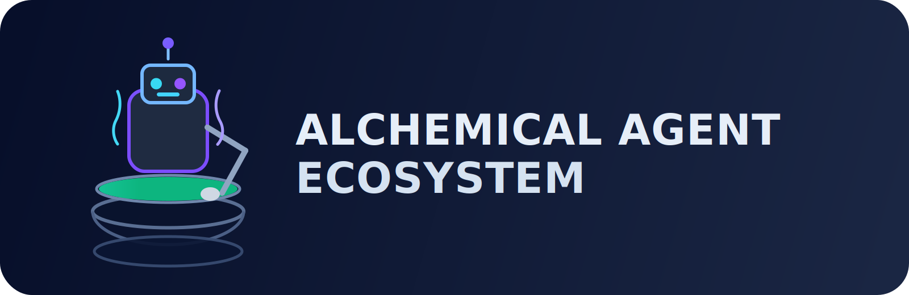
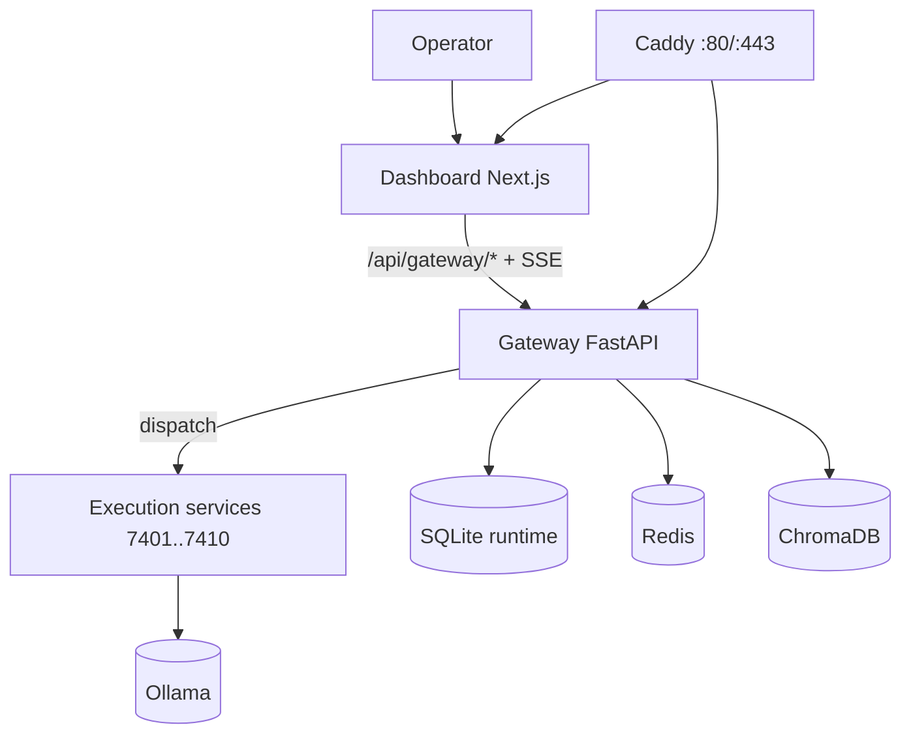
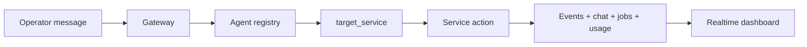

<h1 align="center">⚗️ Alchemical Agent Ecosystem</h1>

<p align="center">
  
</p>

<p align="center"><em>Local-first multi-agent cockpit for real orchestration, realtime control, and safe operations.</em></p>

<p align="center">
  
</p>

<p align="center">
  <a href="./LICENSE"></a>
  <a href="https://github.com/smouj/alchemical-agent-ecosystem/commits/main"></a>
  <a href="https://github.com/smouj/alchemical-agent-ecosystem/actions/workflows/ci.yml"></a>
  <a href="https://github.com/smouj/alchemical-agent-ecosystem/actions/workflows/release.yml"></a>
  <a href="https://github.com/smouj/alchemical-agent-ecosystem/actions/workflows/sync-project-status.yml"></a>
  
  
  
  
  
  
</p>

<p align="center">
  <a href="./README.md"></a>
  <a href="./README.es.md"></a>
</p>

---

## 🚀 Installation first (recommended)

```bash
cd /mnt/d/alchemical-agent-ecosystem
./install.sh --wizard
./scripts/alchemical up-fast
curl -fsS http://localhost/gateway/health
```

Runtime URLs:
- `http://localhost` → runtime via Docker + Caddy
- `http://localhost:3000` → dashboard dev mode (`cd apps/alchemical-dashboard && npm run dev`)

---

## ✨ What this project is for

Use Alchemical when you need a **local operational cockpit** for AI-agent workflows:
- orchestrate logical agents over real services,
- manage connectors/jobs/events/chat from one place,
- run multi-agent discussions and action dispatch,
- keep runtime observable, auditable, and safe.

---

## 🧠 Key capabilities (implemented)

| Area | Current capability |
|---|---|
| Agent control | Start/stop/restart + dispatch checks |
| Agent customization | **Agent Node Studio** (nodes + skill/tool tags) |
| Chat | Shared thread + direct ask + roundtable |
| Realtime | SSE streams for chat/events/usage/logs |
| Ops safety | Token auth + RBAC + API keys + secret scan |
| Runtime data | Jobs, events, usage and chat persisted |

---

## 🏗️ Architecture (current reality)





---

## 🧩 API highlights

- `POST /gateway/chat/ask`
- `POST /gateway/chat/roundtable`
- `GET /gateway/chat/stream`
- `GET /gateway/usage/summary`
- `POST /gateway/connectors/webhook/{channel}`

Full reference: [`docs/API_REFERENCE.md`](./docs/API_REFERENCE.md)

---

## 📚 Documentation

- [`docs/README.md`](./docs/README.md)
- [`docs/INSTALLATION.md`](./docs/INSTALLATION.md)
- [`docs/CLI_REFERENCE.md`](./docs/CLI_REFERENCE.md)
- [`docs/ARCHITECTURE.md`](./docs/ARCHITECTURE.md)
- [`docs/OPERATIONS_RUNBOOK.md`](./docs/OPERATIONS_RUNBOOK.md)

---

## 🔄 Project ritual

```bash
bash ops/ritual-sync.sh
```

---

## 📄 License

MIT
