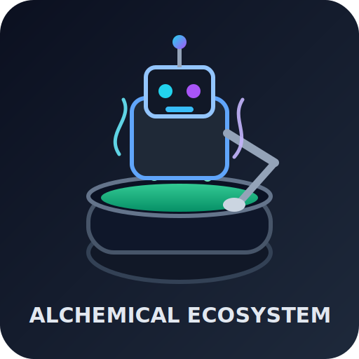

<h1 align="center">Alchemical Agent Ecosystem</h1>

<p align="center">
  
</p>

<p align="center">
  <strong>Local-first, self-hosted multi-agent AI platform</strong><br/>
  Docker-native · No paid APIs required · Production-oriented operations
</p>

<p align="center">
  <a href="./LICENSE"></a>
  <a href="https://github.com/smouj/alchemical-agent-ecosystem/commits/main"></a>
  
  
  
</p>

<p align="center">
  <a href="./README.es.md">🇪🇸 Español</a> · <a href="./README.md">🇬🇧 English</a>
</p>

---

## Table of Contents

- [Overview](#overview)
- [Core Features](#core-features)
- [Architecture](#architecture)
- [Services Map](#services-map)
- [Dashboard (Alchemical Control Panel)](#dashboard-alchemical-control-panel)
- [Installation & Operations](#installation--operations)
- [2GB RAM Profile](#2gb-ram-profile)
- [Security Guardrails](#security-guardrails)
- [Project Structure](#project-structure)
- [Operational Notes](#operational-notes)
- [License](#license)

---

## Overview

**Alchemical Agent Ecosystem** is a unified, self-hosted platform to run specialized AI agents locally.

It is designed for:
- low-cost infrastructure,
- reproducible Docker operations,
- local model execution through Ollama,
- secure and auditable workflows.

---

## Core Features

| Capability | Description |
|---|---|
| Multi-agent runtime | 10 specialized agent services (ports `7401`–`7410`) |
| Local-first AI stack | Ollama + Redis + ChromaDB |
| Reverse proxy | Caddy with service discovery (no hardcoded host IPs) |
| One-command ops | `./scripts/alchemical` CLI for install, run, logs, doctor |
| Premium dashboard | Real-time control panel with health, logs, actions and config |
| Security baseline | Secret scanning + pre-commit hook guardrails |
| Low-RAM mode | Dedicated 2GB profile for constrained machines |

---

## Architecture

```text
                     ┌───────────────────────────────┐
                     │      Alchemical Dashboard     │
                     │ (Next.js + runtime API layer) │
                     └───────────────┬───────────────┘
                                     │
                               HTTP / API
                                     │
┌────────────────────────────────────┴────────────────────────────────────┐
│                                CADDY :80                               │
└───────┬───────────────────────────────────────────────────────────┬──────┘
        │                                                           │
        │ /gateway/*                                                │ /<agent>/*
        │                                                           │
┌───────▼────────────────────┐                         ┌────────────▼────────────┐
│      alchemical-gateway    │                         │   Agent services (10)   │
│ dispatch + orchestration   │                         │ 7401..7410 (FastAPI)    │
└───────┬────────────────────┘                         └────────────┬────────────┘
        │                                                           │
        └───────────────┬───────────────────────────────────────────┘
                        │
      ┌─────────────────▼──────────────┐
      │        Shared local stack      │
      │ Ollama · Redis · ChromaDB      │
      └────────────────────────────────┘
```

---

## Services Map

### Agent Services

| Service | Port | Primary Endpoint |
|---|---:|---|
| velktharion | 7401 | `/navigate` |
| synapsara | 7402 | `/query` |
| kryonexus | 7403 | `/search` |
| noctumbra-mail | 7404 | `/send` |
| temporaeth | 7405 | `/plan` |
| vaeloryn-conclave | 7406 | `/deliberate` |
| ignivox | 7407 | `/transform` |
| auralith | 7408 | `/live` |
| resonvyr | 7409 | `/voice` |
| fluxenrath | 7410 | `/` |

### Core Infrastructure

| Component | Purpose |
|---|---|
| Caddy | Entry point and reverse proxy |
| alchemical-gateway | Agent dispatch and orchestration API |
| Redis | Fast runtime data/cache layer |
| ChromaDB | Vector memory layer |
| Ollama | Local LLM model hosting |

---

## Dashboard (Alchemical Control Panel)

Path: `apps/alchemical-dashboard`

### What is real-time (non-mock)
- Agent status from `docker compose ps` + `/health`
- Start/stop/restart actions for services
- Real logs from `docker compose logs`
- Core service health (Caddy, Redis, ChromaDB, Ollama, Gateway)
- CPU/RAM metrics from `docker stats`
- Persisted dashboard settings via runtime config API

### Runtime API Endpoints (dashboard)

| Endpoint | Method | Purpose |
|---|---|---|
| `/api/agents` | GET | Real agent inventory + status |
| `/api/system` | GET | Core services health |
| `/api/control` | POST | Start/stop/restart allowed agent services |
| `/api/logs` | GET | Tail logs by service |
| `/api/metrics` | GET | CPU/RAM usage from Docker stats |
| `/api/config` | GET/PUT | Persistent dashboard tuning |
| `/api/agent/[name]/dispatch` | POST | Real agent request dispatch |

---

## Installation & Operations

### Quick Start

```bash
cd /mnt/d/alchemical-agent-ecosystem
./scripts/alchemical wizard
```

### CLI Commands

```bash
./scripts/alchemical doctor
./scripts/alchemical setup-hooks
./scripts/alchemical scan-secrets
./scripts/alchemical install --domain localhost --profile standard --model phi3:mini
./scripts/alchemical up
./scripts/alchemical status
./scripts/alchemical logs velktharion
./scripts/alchemical dashboard
```

---

## 2GB RAM Profile

For constrained hosts (target: **~2GB RAM**):

```bash
./scripts/alchemical install --profile min --domain localhost
# or fast minimal boot:
./scripts/alchemical up-min
```

### What `min` profile starts
- `caddy`
- `redis`
- `chromadb`
- `ollama`
- `alchemical-gateway`
- `velktharion`
- `synapsara`

Default lightweight model in wizard for min profile: `tinyllama:1.1b`.

---

## Security Guardrails

| Control | Status |
|---|---|
| `.gitignore` hardened for secrets/certs/keys | ✅ |
| `scripts/security/check-secrets.sh` | ✅ |
| pre-commit hook (`.githooks/pre-commit`) | ✅ |
| CLI secret scan command | ✅ (`./scripts/alchemical scan-secrets`) |

Recommended before every push:

```bash
./scripts/alchemical doctor
./scripts/alchemical scan-secrets
```

---

## Project Structure

```text
assets/                  # Branding assets
apps/alchemical-dashboard/  # Next.js control panel
docs/                    # Architecture + operational docs
gateway/                 # Alchemical gateway service
infra/caddy/             # Reverse proxy config
infra/scripts/           # Installer/bootstrap scripts
scripts/                 # Operational CLI and automation helpers
services/                # Agent services (FastAPI)
shared/                  # Shared schemas/contracts
workspace/skills/        # Agent skills workspace
```

---

## Operational Notes

- This repository is optimized for self-hosted Linux/WSL Docker environments.
- Keep runtime secrets out of Git (`.env`, certs, keys, token files).
- If GPU metrics are required, add NVIDIA runtime/DCGM integration.

---

## License

MIT
