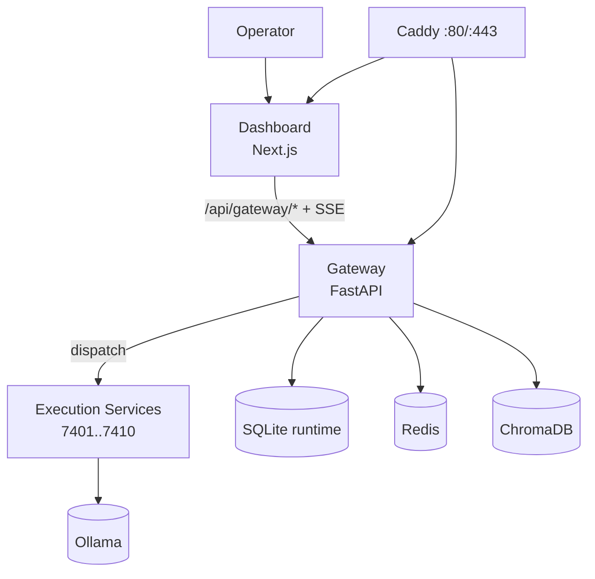
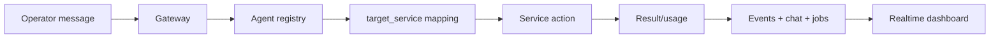

<h1 align="center">⚗️ Alchemical Agent Ecosystem</h1>

<p align="center">
  
</p>

<p align="center"><em>Local-first multi-agent control plane · real runtime orchestration · production-minded operations</em></p>

<p align="center">
  <a href="./LICENSE"></a>
  <a href="https://github.com/smouj/alchemical-agent-ecosystem/commits/main"></a>
  <a href="https://github.com/smouj/alchemical-agent-ecosystem/actions/workflows/ci.yml"></a>
  <a href="https://github.com/smouj/alchemical-agent-ecosystem/actions/workflows/release.yml"></a>
  <a href="https://github.com/smouj/alchemical-agent-ecosystem/actions/workflows/sync-project-status.yml"></a>
  
  
  
  
  
</p>

<p align="center">
  <a href="./README.md"></a>
  <a href="./README.es.md"></a>
</p>

---

## Overview

Alchemical Agent Ecosystem is a local-first platform where:
- Dashboard is the operator cockpit,
- Gateway is the policy/routing/runtime boundary,
- Execution services perform real actions,
- Events/jobs/chat/usage are persisted and observable.

No fake runtime behavior is used for core flows.

---

## Architecture (current reality)

<p align="center"><strong>Runtime architecture</strong></p>

<div align="center">



</div>

<p align="center"><strong>Agent logic model</strong></p>

<div align="center">



</div>

---

## Dashboard capabilities (implemented)

- Live status for services and logical agents
- Agent controls (start/stop/restart + ping dispatch)
- Agent Node Studio: interactive node graph to map agents and bind skills/tools visually
- Gateway chat workbench with:
  - thread messages,
  - direct ask to selected agent,
  - multi-agent roundtable,
  - repo/thinking/auto-edit metadata,
  - attachment metadata chips
- Jobs & events realtime panels
- Usage/cost realtime panel
- Admin/API keys + connector ops
- Sidebar section navigation (functional)
- Carbon/ash visual theme with turquoise/purple/sky/green alchemical effects

---

## Essential commands

```bash
# 1) install
./install.sh --wizard

# 2) start runtime
./scripts/alchemical up-fast

# 3) health check
curl -fsS http://localhost/gateway/health

# 4) dashboard (dev mode)
cd apps/alchemical-dashboard && npm run dev
```

Run modes:
- Runtime via Caddy: `http://localhost`
- Dashboard dev: `http://localhost:3000`

---

## API highlights

Gateway:
- `POST /gateway/chat/ask`
- `POST /gateway/chat/roundtable`
- `GET /gateway/chat/stream`
- `GET /gateway/jobs`
- `GET /gateway/usage/summary`
- `POST /gateway/connectors/webhook/{channel}`

Dashboard proxy:
- `POST /api/gateway/chat-ask`
- `POST /api/gateway/chat-roundtable`
- `GET /api/gateway/chat-stream`

Full API: [`docs/API_REFERENCE.md`](./docs/API_REFERENCE.md)

---

## Documentation map

- [`docs/README.md`](./docs/README.md) — docs index
- [`docs/INSTALLATION.md`](./docs/INSTALLATION.md) — installation/start/perf bootstrap
- [`docs/CLI_REFERENCE.md`](./docs/CLI_REFERENCE.md) — full command catalog
- [`docs/ARCHITECTURE.md`](./docs/ARCHITECTURE.md) — architecture and invariants
- [`docs/API_REFERENCE.md`](./docs/API_REFERENCE.md) — endpoint reference
- [`docs/OPERATIONS_RUNBOOK.md`](./docs/OPERATIONS_RUNBOOK.md) — operations and maintenance
- [`docs/PROJECT_STATUS.md`](./docs/PROJECT_STATUS.md) — auto-synced project snapshot

---

## Operations ritual (project/repo hygiene)

```bash
bash ops/ritual-sync.sh
```

This runs project tidy, status sync, secret scan, rebase/push, and final checks.

---

## License

MIT
